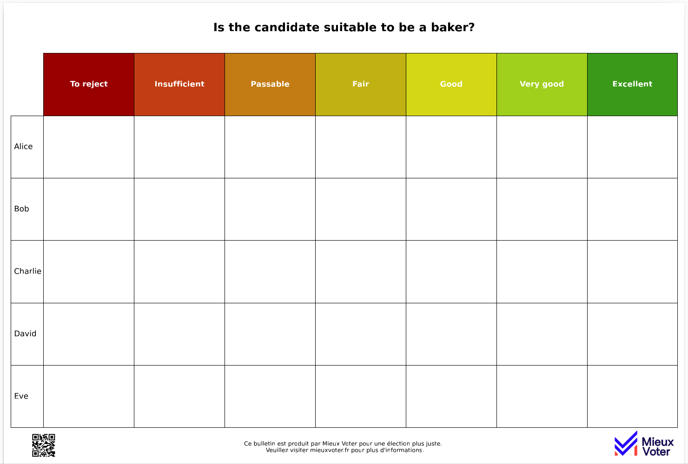

# Majority Judgement Ballot Generator

This module provides functionality to generate majority judgement ballots in various paper sizes. It uses Matplotlib to create the ballots and save them as PDF files.




## Table of Contents

- [Installation](#installation)
- [Usage](#usage)
- [Classes](#classes)
- [Constants](#constants)
- [Main Function](#main-function)
- [Examples](#examples)

## Installation

To use this module, you need to have Python installed along with the following dependencies:

```bash
conda install -c conda-forge matplotlib numpy pillow
```

# Usage
## Basic Usage
### Create a Ballot Configuration:

```python
from ballot_generator import BallotConfig, BallotGenerator, PaperSize

question = "Is the candidate suitable to be a baker?"
candidates = ["Alice", "Bob", "Charlie", "David", "Eve", "Gérard"]
grades = ["To reject", "Insufficient", "Passable", "Fair", "Good", "Very good", "Excellent"]

config = BallotConfig(question, candidates, grades)
```
### Generate a Single Ballot:

```python
generator = BallotGenerator(config)
output_filename = "majority_judgement_ballot_A4_landscape.pdf"
generator.generate_ballot(output_filename, PaperSize.A4)
```

### Generate Multiple Ballots with Shuffled Candidate Orders:

```python
generator.generate_shuffled_ballots(100, paper_size=PaperSize.A4)
```

# License
This code is released under the MIT License.

# Acknowledgments
This code was developed with the support of Mieux Voter.

Acknowledgments
This code was developed with the support of Mieux Voter.